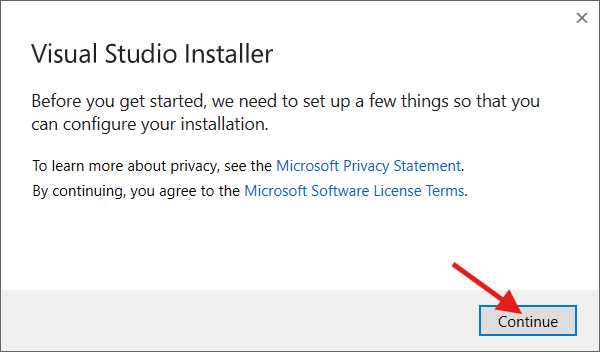
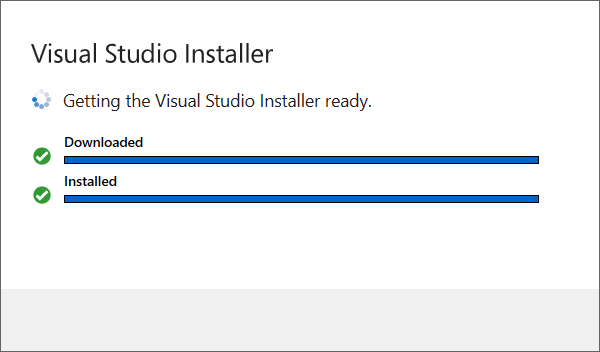
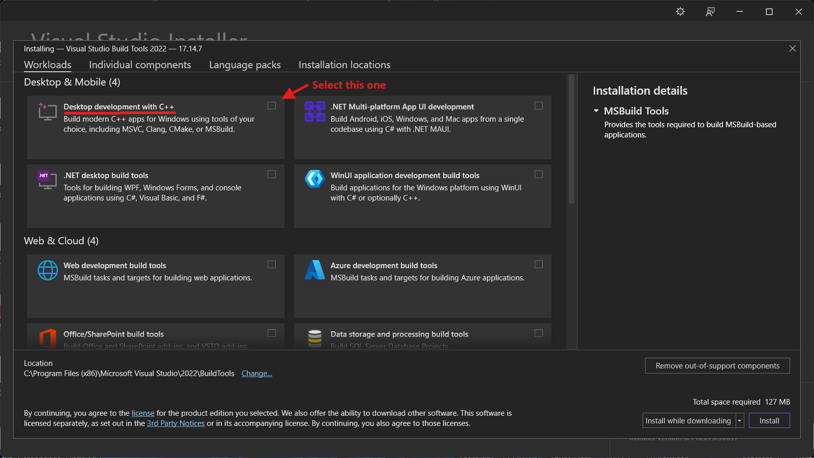
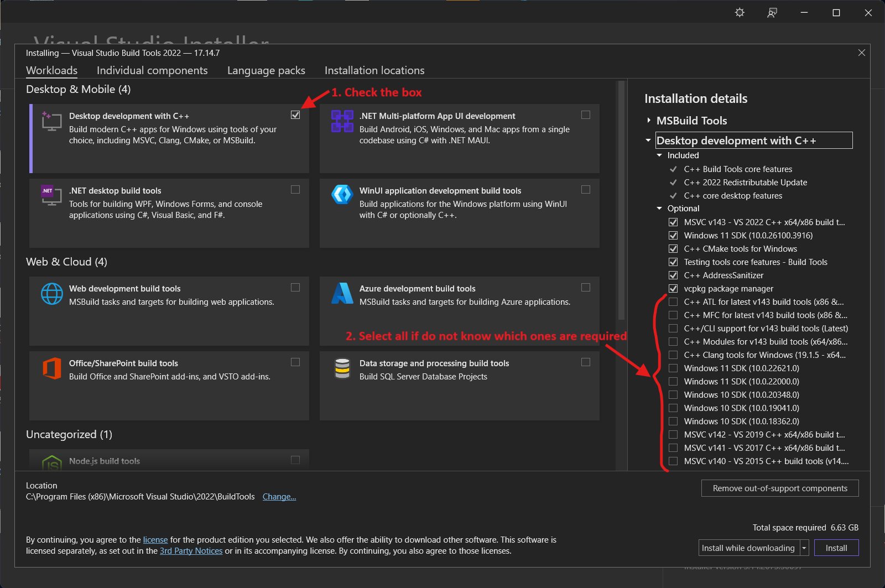
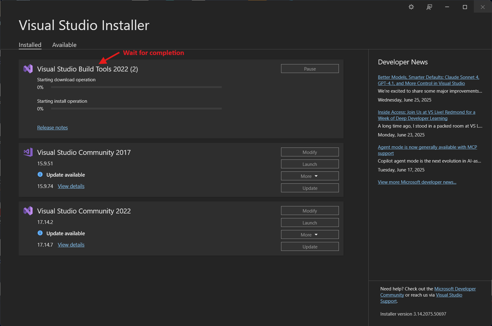
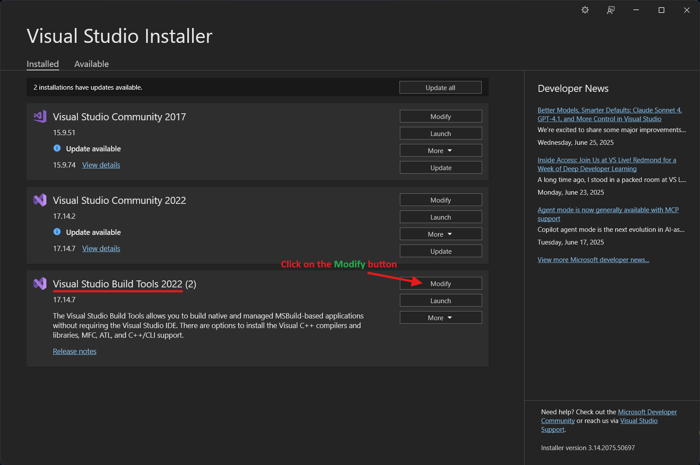
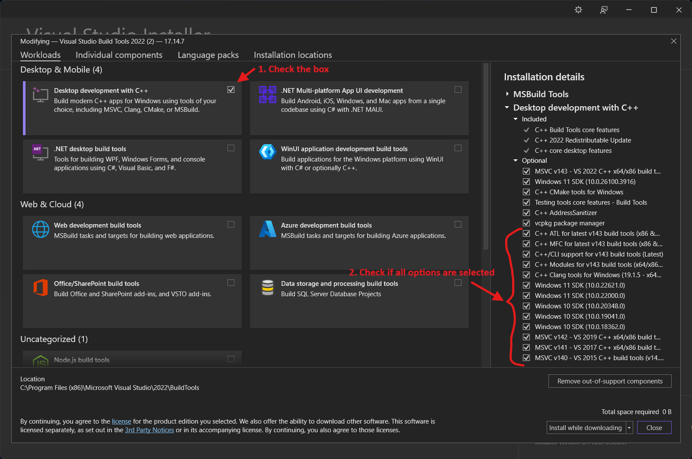
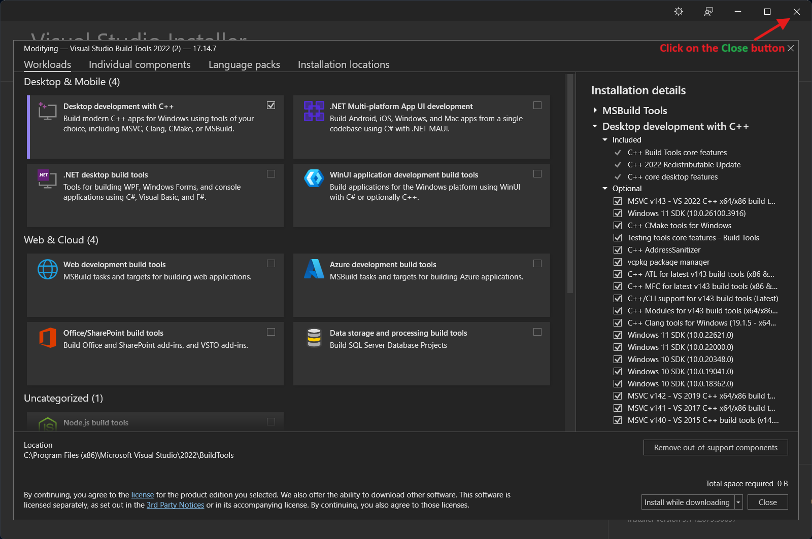

# ⚙️ `Microsoft C++ Build Tools` Installation Guide

This guide will help you download, install, and configure the `Microsoft C++ Build Tools`, which are required to build native C++ projects on Windows.

> **⚠️ Note:**  
> If you encounter the error:  
> `error: Microsoft Visual C++ 14.0 or greater is required. Get it with "Microsoft C++ Build Tools"`  
> then you need to install the `Microsoft C++ Build Tools` by following these steps to resolve it.

---

## 📑 Table of Contents

- [1️⃣ Download the Microsoft C++ Build Tools](#1️⃣-download-the-microsoft-c-build-tools)
- [2️⃣ Run the Installer](#2️⃣-run-the-installer-vs_buildtoolsexe)
- [3️⃣ Select the Desktop development with C++ Workload](#3️⃣-select-the-desktop-development-with-c-workload-️)
- [4️⃣ Check All Optional Tools](#4️⃣-if-unsure-check-all-optional-tools-✅)
- [5️⃣ Click the Install Button](#5️⃣-click-the-install-button-▶️)
- [6️⃣ Wait for Installation to Complete](#6️⃣-wait-for-the-installation-to-complete-⏳)
- [7️⃣ Verify the Installation](#7️⃣-verify-the-installation-🔍)
- [8️⃣ Restart Your Computer](#8️⃣-after-completing-installation-close-the-visual-studio-installer-and-restart-your-computer-🔄)

---

## 1️⃣ **Download** the `Microsoft C++ Build Tools`

👉 [Download here](https://visualstudio.microsoft.com/visual-cpp-build-tools/)

## 2️⃣ **Run** the installer (`vs_BuildTools.exe`)  

  

## 3️⃣ **Select** the `Desktop development with C++` workload 🖥️  

## 4️⃣ If unsure, **check all optional tools** ✅  

## 5️⃣ **Click** the `Install` button ▶️  

## 6️⃣ **Wait** for the installation to complete ⏳  

## 7️⃣ **Verify** the installation 🔍  

  

## 8️⃣ After completing installation, **close the Visual Studio Installer** and **restart your computer** 🔄  

