# 🤖 `Ollama` Installation and Usage Guide

This guide walks you through downloading, installing, verifying, and using `Ollama` on Windows 10 or 11.

---

## 📑 Table of Contents

- [🧩 Ollama Installation](#-ollama-installation)
  - [📚 Official Documentation](#-official-documentation)
  - [📥 Download the Installer](#-download-the-installer)
  - [⚙️ Run the Installer](#️-run-the-installer)
  - [✅ Verify Installation](#-verify-installation)
- [🌐 Accessing Ollama](#-accessing-ollama)
- [🛠️ Usage](#️-usage)
  - [1️⃣ Pull the Default deepseek-r1 Model (7B)](#1️⃣-pull-the-default-deepseek-r1-model-7b)
  - [2️⃣ List Installed Models](#2️⃣-list-installed-models)
  - [3️⃣ Alternative Check via API](#3️⃣-alternative-check-via-api)
  - [4️⃣ Test the API via PowerShell](#4️⃣-test-the-api-via-powershell)
  - [5️⃣ Run and Chat with the Model](#5️⃣-run-and-chat-with-the-model)

---

## 🧩 Ollama Installation

### 📚 **Official Documentation**

Read the official documentation here:  
👉 [https://github.com/ollama/ollama/tree/main/docs](https://github.com/ollama/ollama/tree/main/docs)

### 📥 **Download the Installer**

Visit the official website: [Ollama Download](https://ollama.com/download/windows) and click **Download for Windows** to get `OllamaSetup.exe`.

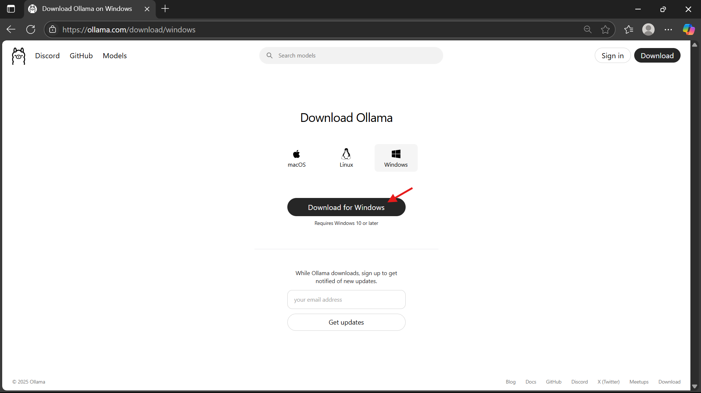

Alternatively, you can download it from [Ollama GitHub Releases](https://github.com/ollama/ollama/releases).

### ⚙️ **Run the Installer**

Run `OllamaSetup.exe` and follow the installation prompts.

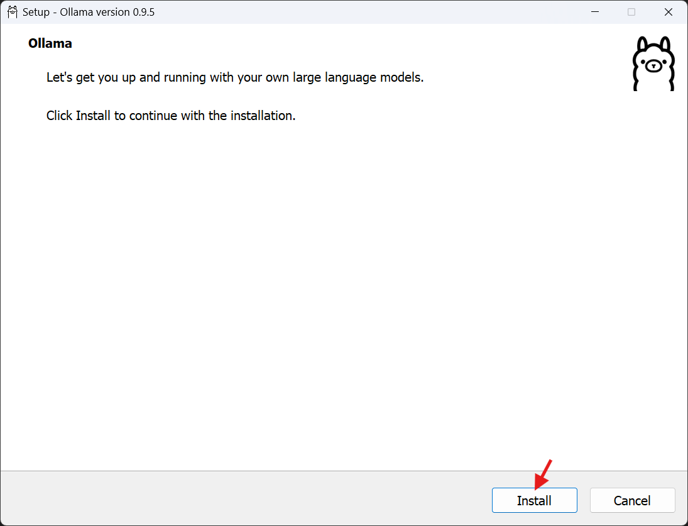  
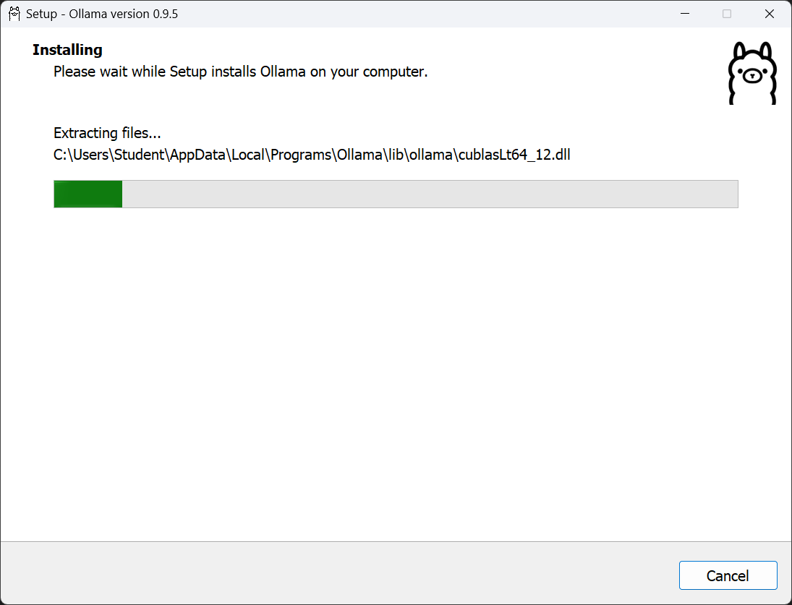  
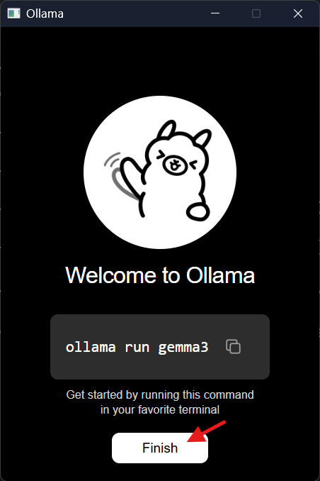

### ✅ **Verify Installation**

Open **PowerShell** and run:

```powershell
ollama --version
```

**Expected Output**:

```powershell
ollama version 0.9.5
```

Also, check the system tray to verify that **Docker Desktop** is running.

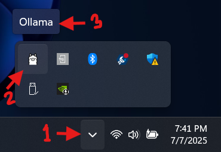

---

## 🌐 Accessing Ollama

To start the Ollama server (if not already running), open **PowerShell** and run:

```powershell
ollama serve
```

- Access the server at: [http://localhost:11434](http://localhost:11434)

---

## 🛠️ Usage

### 1️⃣ Pull the Default `deepseek-r1` Model (7B)

Open **PowerShell** and run:

```powershell
ollama pull deepseek-r1
```

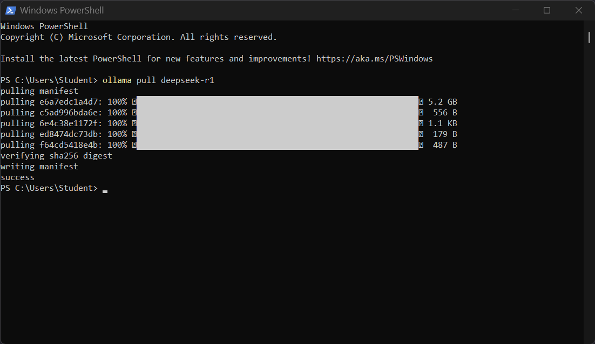

**To pull specific versions:**

```powershell
ollama run deepseek-r1:1.5b
ollama run deepseek-r1:671b
```

### 2️⃣ List Installed Models

```powershell
ollama list
```

**Expected Output**:

```text
NAME                    ID              SIZE
deepseek-r1:latest      xxxxxxxxxxxx    X.X GB
```

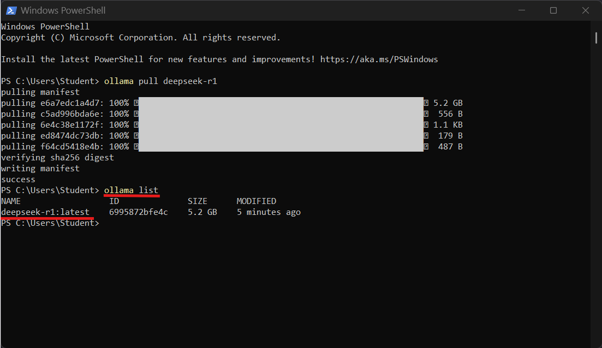

### 3️⃣ Alternative Check via API

```powershell
curl http://localhost:11434/api/tags
```

**Expected Output:**  
A JSON response listing the installed models, including `deepseek-r1:latest`.

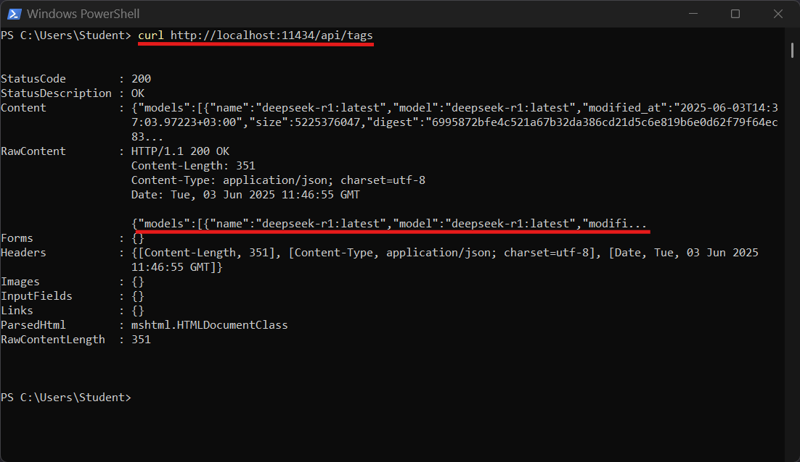

### 4️⃣ Test the API via PowerShell

Run the following in **PowerShell**:

```powershell
Invoke-RestMethod -Uri http://localhost:11434/api/generate -Method Post -Body '{"model": "deepseek-r1", "prompt": "Hello, world!", "stream": false}' -ContentType "application/json"
```

**Expected Output:**  
A JSON object with the model’s response to the "Hello, world!" prompt.

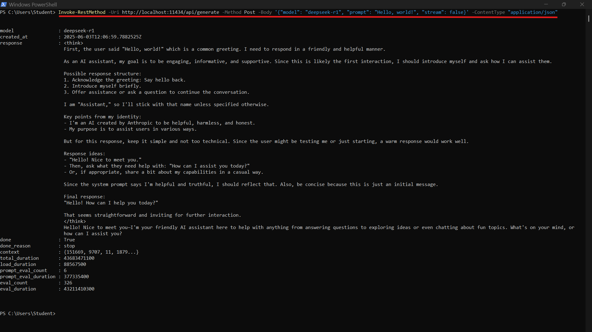

### 5️⃣ Run and Chat with the Model

To start an interactive chat session with the `deepseek-r1` model:

```powershell
ollama run deepseek-r1
```

- Type your messages to chat with the model.
- Type `/bye` and press `Enter` or use `Ctrl + D` to exit the session.

  
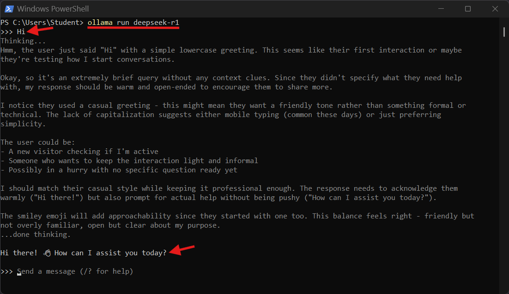  
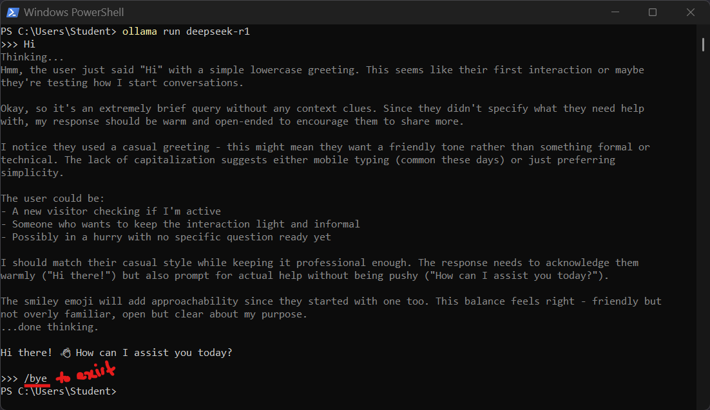

---
