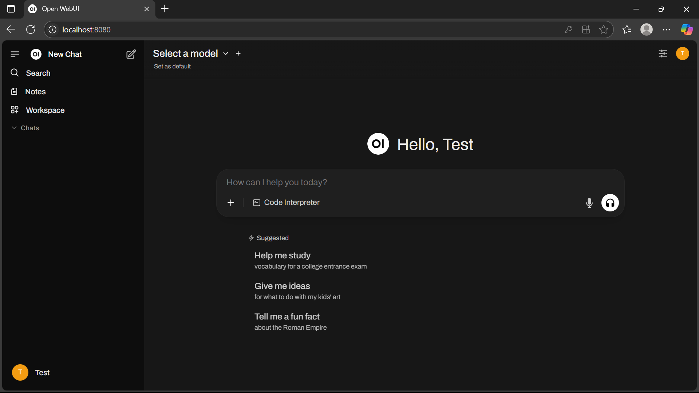

# 🚀 `Open WebUI` Installation Guide

This guide will help you install and run `Open WebUI` on a local Windows 10/11 machine.

---

## 📑 Table of Contents

- [🛠️ Prerequisites](#️-prerequisites)
  - [💻 For Host Computer](#-for-host-computer)
  - [🐳 For Docker](#-for-docker)
- [⚙️ Installation Steps](#️-installation-steps)
  - [💻 Install on Host Computer](#-install-on-host-computer)
  - [🐳 Install on Docker](#-install-on-docker)
  - [🌐 Access the application](#-access-the-application)
- [🩺 Troubleshooting](#-troubleshooting)
  - [🐍 Check Python version in the virtual environment](#-check-python-version-in-the-virtual-environment)
  - [🧹 Remove the virtual environment](#-remove-the-virtual-environment)
  - [⚠️ Error: Microsoft Visual C++ 14.0 or greater is required](#️-error-microsoft-visual-c-140-or-greater-is-required)
- [📚 Resources](#-resources)

---

## 🛠️ Prerequisites

Before you begin, ensure you have the following installed:

### 💻 For Host Computer:

- **🐍 Python**: See [`Python` Installation Guide](./python-installation-guide.md)
- **📦 uv** (Python package/environment manager): See [`uv` Installation Guide](./uv-installation-guide.md)
- **🛠️ Microsoft C++ Build Tools**: See [`Microsoft C++ Build Tools` Installation Guide](./microsoft-c++-build-tools-installation-guide.md)

### 🐳 For Docker:

- **🐳 Docker Desktop**: See [`Docker Desktop` Installation Guide](./docker-desktop-installation-guide.md)

---

## ⚙️ Installation Steps

### 💻 Install on Host Computer

1. **Create a virtual environment with `uv`**  

    ```bash
    uv venv --python=python3.12
    ```

2. **Activate the virtual environment**

    ```bash
    .venv\Scripts\activate
    ```

3. **Initialize the environment**

    ```bash
    uv init
    ```

4. **Install Open WebUI**

    ```bash
    uv add open-webui
    ```

5. **Run the server**

    ```bash
    open-webui serve
    ```

    

### 🐳 Install on Docker

```bash
docker run -d -p 8080:8080 -v open-webui:/app/backend/data -e OLLAMA_API_BASE_URL=http://host.docker.internal:11434 --name open-webui ghcr.io/open-webui/open-webui:main
```


### 🌐 Access the application

Open your browser and go to: [http://localhost:8080](http://localhost:8080/)




---

## 🩺 Troubleshooting

### 🐍 Check Python version in the virtual environment

```bash
python --version
```

---

### 🧹 Remove the virtual environment

Inside your project folder, you can manually delete the folder, or use these commands:

**PowerShell:**

```powershell
Remove-Item -Recurse -Force .venv
```

**Bash (e.g., Git Bash or WSL):**

```bash
rm -rf .venv
```

You may also want to delete related `uv` environment files:

**PowerShell:**

```powershell
Remove-Item -Recurse -Force "$env:APPDATA\uv"
```

**Bash (e.g., Git Bash or WSL):**

```bash
rm -rf "$APPDATA/uv"
```

Or manually navigate to:

```
C:\Users\<user>\AppData\Roaming\uv
```

and delete the folder.

---

### ⚠️ Error: Microsoft Visual C++ 14.0 or greater is required

If you see an error like:

```plaintext
error: Microsoft Visual C++ 14.0 or greater is required. Get it with "Microsoft C++ Build Tools"
```

Refer to the [`Microsoft C++ Build Tools` Installation Guide](./microsoft-c++-build-tools-installation-guide.md)

---

## 📚 Resources

- 📘 [Open WebUI Documentation](https://docs.openwebui.com/)
- 🐙 [Open WebUI GitHub Repository](https://github.com/open-webui/open-webui)
- 📦 [Open WebUI on PyPI](https://pypi.org/project/open-webui/)
