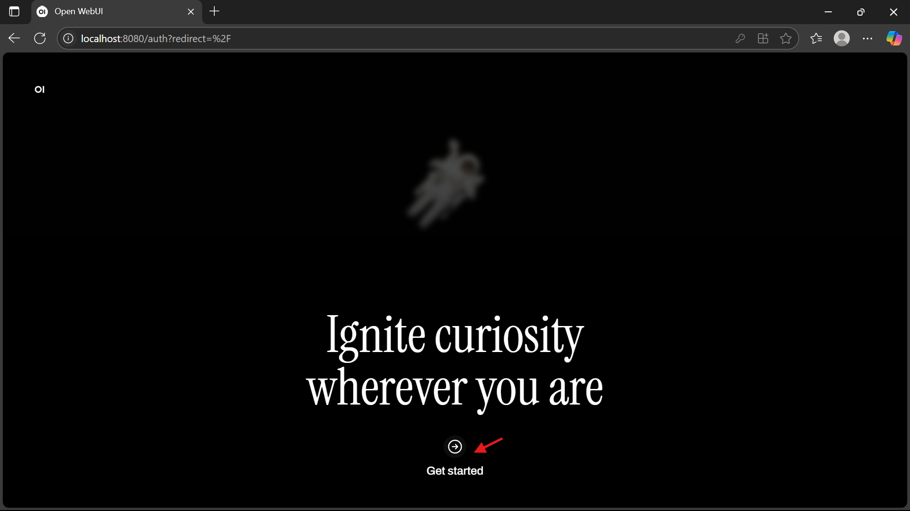

# 🚀 `Open WebUI` Installation Guide

This guide will help you install and run `Open WebUI` on local Windows 10/11 machine.

---

## 📑 Table of Contents

- [🚀 Open WebUI Installation Guide](#-open-webui-installation-guide)
- [🛠️ Prerequisites](#️-prerequisites)
- [⚙️ Installation Steps](#️-installation-steps)
  - [1. Create a virtual environment with uv](#1-create-a-virtual-environment-with-uv)
  - [2. Activate the virtual environment](#2-activate-the-virtual-environment)
  - [3. Initialize the environment](#3-initialize-the-environment)
  - [4. Install Open WebUI](#4-install-open-webui)
  - [5. Run the server](#5-run-the-server)
  - [6. Access the application](#6-access-the-application)
- [🩺 Troubleshooting](#-troubleshooting)
  - [🐍 Check Python version in the virtual environment](#-check-python-version-in-the-virtual-environment)
  - [🧹 Remove the virtual environment](#-remove-the-virtual-environment)
  - [⚠️ Error: Microsoft Visual C++ 14.0 or greater is required](#️-error-microsoft-visual-c-140-or-greater-is-required)
- [📚 Resources](#-resources)

---

## 🛠️ Prerequisites

Before you begin, ensure you have the following installed:

- **Python**: See [`Python` Installation Guide](./python-installation-guide.md)
- **uv** (Python package/environment manager): See [`uv` Installation Guide](./uv-installation-guide.md)
- **Microsoft C++ Build Tools**: See [`Microsoft C++ Build Tools` Installation Guide](./microsoft-c++-build-tools-installation-guide.md)

---

## ⚙️ Installation Steps

1. **Create a virtual environment with uv**  

    ```bash
    uv venv --python=python3.12
    ```

    ## Activate the virtual environment

    ```bash
    .venv\Scripts\activate
    ```

2. Initialize the environment

    ```bash
    uv init
    ```

3. Install Open WebUI

    ```bash
    uv add open-webui
    ```

4. Run the server

    ```bash
    open-webui serve
    ```
    
    

5. Access the application

    Open your browser and go to: [http://localhost:8080](http://localhost:8080/)

    
    
    

---

## 🩺 Troubleshooting

### 🐍 **Check Python version in the virtual environment**

```bash
python --version
```

### 🧹 **Remove the virtual environment**

Inside your project folder, you can manually delete the folder, or use these commands:

**PowerShell:**

```powershell
Remove-Item -Recurse -Force .venv
```

**Bash (e.g., Git Bash or WSL):**

```bash
rm -rf .venv
```

You may also want to delete related `uv` environment files:

**PowerShell:**

```powershell
Remove-Item -Recurse -Force "$env:APPDATA\uv"
```

**Bash (e.g., Git Bash or WSL):**

```bash
rm -rf "$APPDATA/uv"
```

Or manually navigate to:

```
C:\Users\<user>\AppData\Roaming\uv
```

and delete the folder.

### ⚠️ **`Error`: Microsoft Visual C++ 14.0 or greater is required**

If you see an error like:

```plaintext
error: Microsoft Visual C++ 14.0 or greater is required. Get it with "Microsoft C++ Build Tools"
```

Refer to [`Microsoft C++ Build Tools` Installation Guide](./microsoft-c++-build-tools-installation-guide.md)

---

## 📚 Resources

- [Open WebUI Documentation](https://docs.openwebui.com/)
- [Open WebUI GitHub Repository](https://github.com/open-webui/open-webui)
- [Open WebUI on PyPI](https://pypi.org/project/open-webui/)

