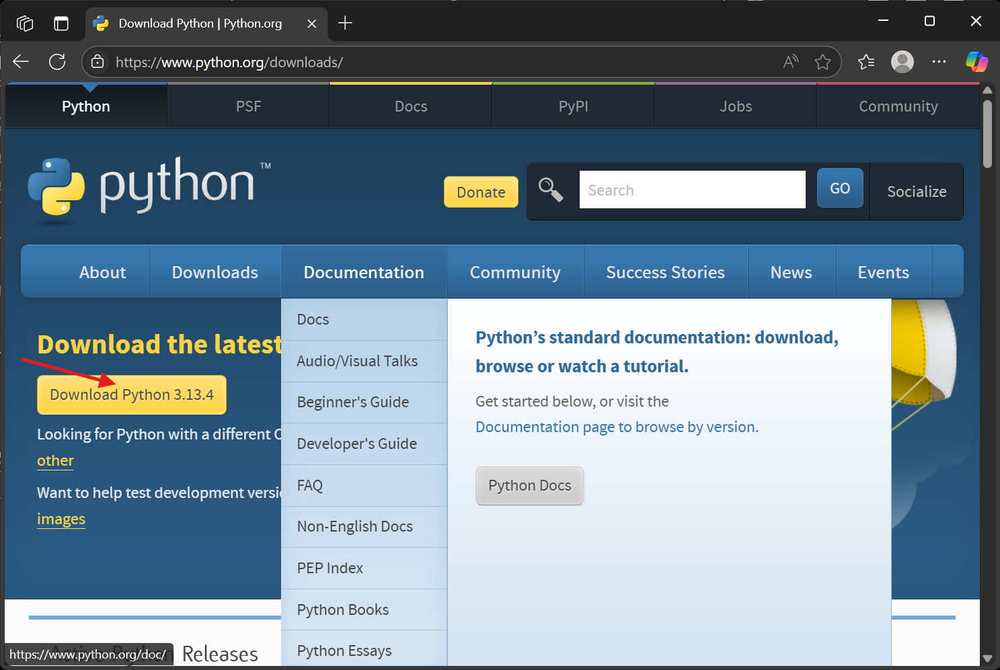
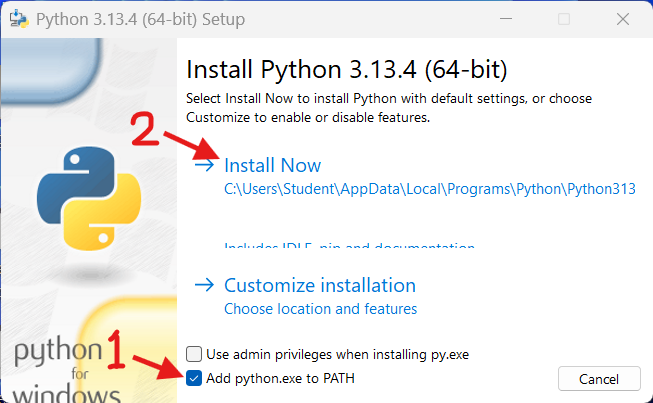
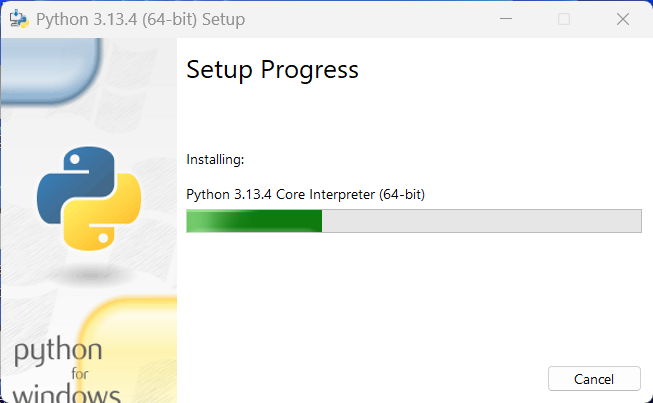
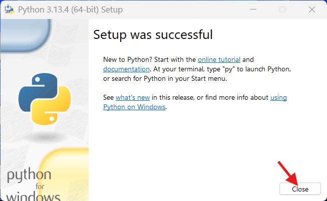
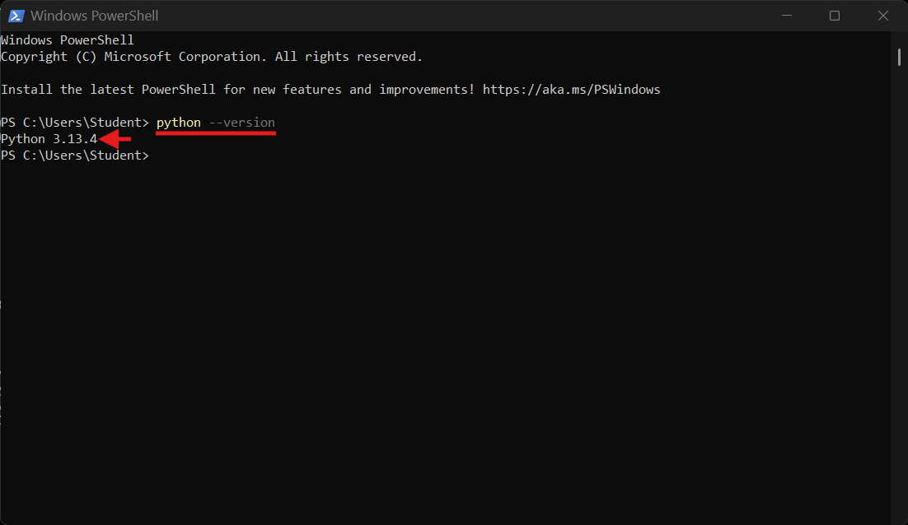
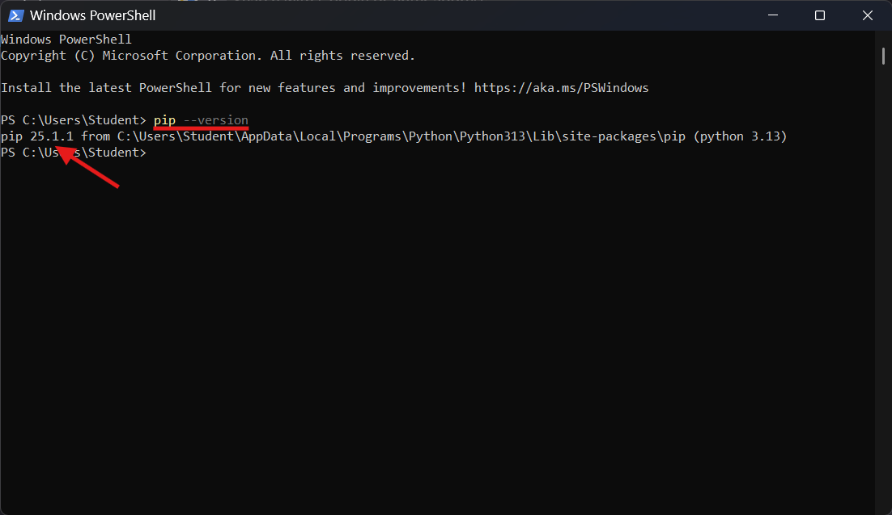

# 🐍 `Python` Installation Guide

This guide shows you how to download, install, and verify `Python` on Windows 10 or 11.

---

## 📑 Table of Contents

1. [📚 Python Documentation](#-python-documentation)
2. [📥 Download Installer](#-download-installer)
3. [⚙️ Run the Installer](#-run-the-installer)
4. [✅ Verify Installation](#-verify-installation)
   - [Check Python Version](#check-python-version)
   - [Check pip Installation](#check-pip-installation)
   - [Upgrade pip (Optional)](#optional-upgrade-pip-to-the-latest-version)

---

## 📚 **`Python` Documentation**  

Read the official documentation:  

👉 [https://www.python.org/doc](https://www.python.org/doc/)

---

## 📥 **Download Installer**
   
Visit offical website [Python Download](https://www.python.org/downloads/) and click **Download for Windows** to get `python-x.xx.x-amd64.exe`.



---

## ⚙️ **Run the Installer**:

Execute `python-x.xx.x-amd64.exe` and follow the installation prompts.





---

## ✅ **Verify Installation**

### Check Python version:

```poweshell
python --version
```



### Check `pip` installation:

```poweshell
pip --version
```



### (Optional) Upgrade `pip` to the latest version:

```poweshell
python -m pip install --upgrade pip
```

---

