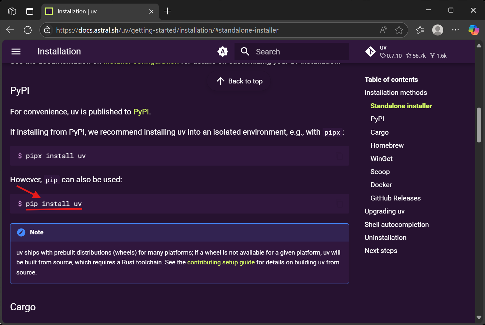
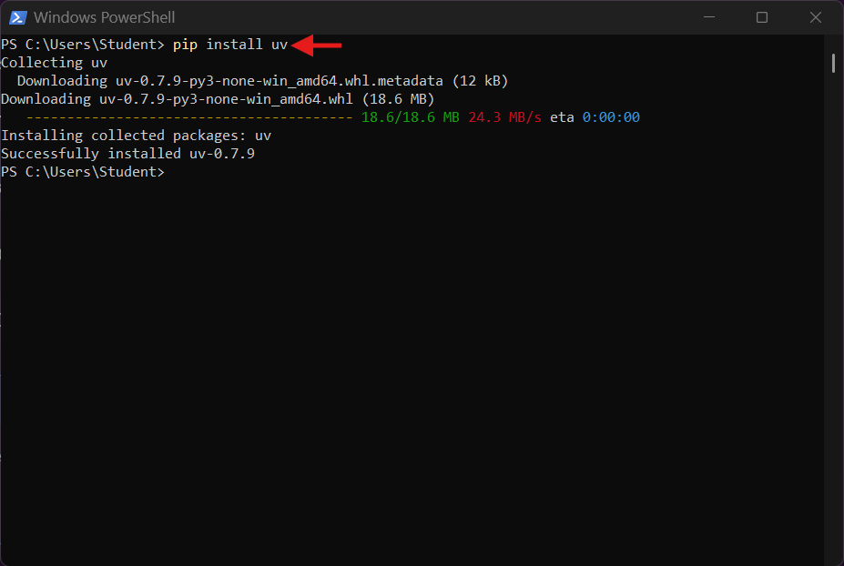
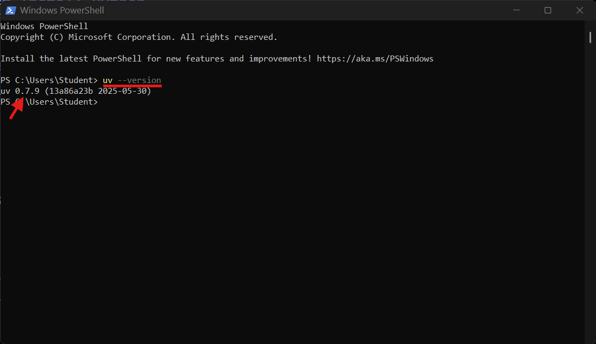
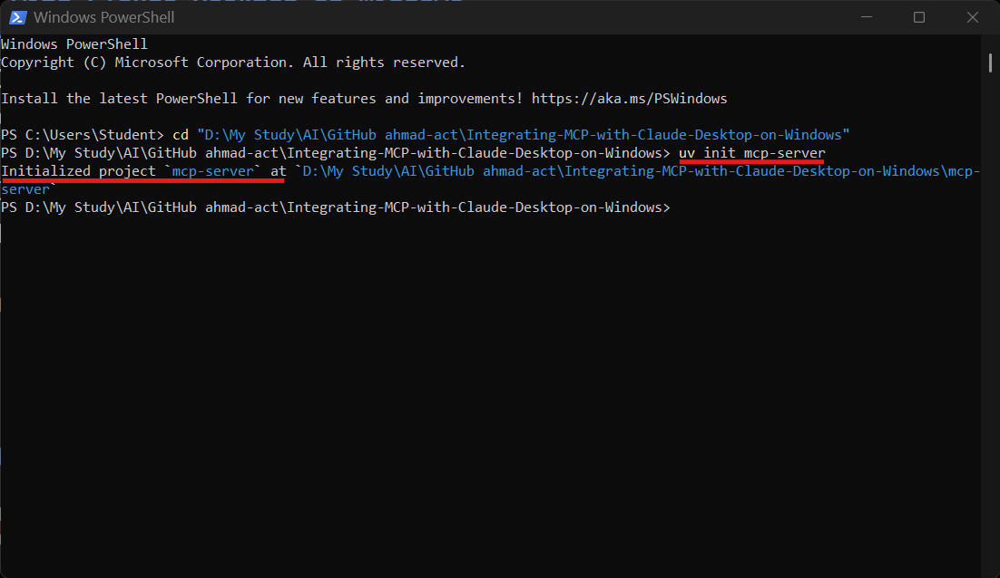
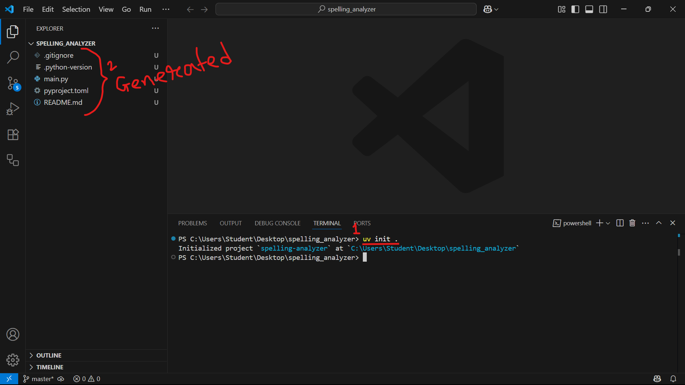

# 📦 `uv` Python Package Manager Installation and Usage Guide

This guide shows you how to download, install, verify and use `uv` on Windows 10 or 11.

---

# 📋 Table of Contents

1. [🛠️ Prerequisites](#-prerequisites)  
2. [🧩 `uv` Installation](#-uv-installation)  
   1. [📚 `uv` Documentation](#-uv-documentation)  
   2. [⚙️ Install `uv`](#-install-uv)  
   3. [✅ Verify Installation](#-verify-installation)  
3. [⚡ `uv` Usage](#-uv-usage)  
   1. [🌟 Virtual Environment](#-virtual-environment)  
   2. [🚀 Create a New Project](#-create-a-new-project)  
   3. [📦 Add Package](#-add-package)  
   4. [🔄 Install all Packages/Dependencies using `pyproject.toml`](#-install-all-packagesdependencies-using-pyprojecttoml)  
   5. [▶️ Run Project](#-run-project)  
4. [🩺 Troubleshooting](#-troubleshooting)  
   1. [🔍 Check Installed Packages](#-check-installed-packages)  
   2. [❌ Uninstall a Package](#-uninstall-a-package)  
   3. [🗑️ Uninstall all Packages](#-uninstall-all-packages)  
   4. [🐍 Check Python version in the virtual environment](#-check-python-version-in-the-virtual-environment)  
   5. [🧹 Remove the virtual environment](#-remove-the-virtual-environment)  

---

## 🛠️ Prerequisites

Before you begin, ensure you have the following installed:

- **Python**: See [`python-installation-guide.md`](./python-installation-guide.md)

---

## 🧩 `uv` Installation 

### 📚 **`uv` Documentation**  

Read the official documentation:  

👉 [https://docs.astral.sh/uv/getting-started/installation](https://docs.astral.sh/uv/getting-started/installation/#standalone-installer)

### ⚙️ **Install `uv`**

Open **PowerShell** and run:

```powershell
pip install uv
```

  


### ✅ **Verify Installation**:

Open **PowerShell** and run:

```powershell
uv --version
```



---

## ⚡ `uv` Usage

### 🌟 **Virtual Environment**

1. 🌀 Create a Virtual Environment:

    ```powershell
    uv venv
    ```

    Install Specific Python Version on Virtual Environment: 

    ```bash
    uv venv --python=python3.11
    ```

    → Creates a new `.venv` using Python 3.11

2. ▶️ Activate the Virtual Environment:

    ```powershell
    .venv\Scripts\activate
    ```

3. ⏹️ Deactivate the Virtual Environment:

    ```powershell
    deactivate
    ```

    ❗ **Tip**: If `deactivate` is not recognized, manually run: [project-root-directory/.venv/Scripts/deactivate.bat](.venv/Scripts/deactivate.bat)
    
    ```powershell
    .venv\Scripts\deactivate.bat
    ```

### 🚀 **Create a New Project**

- ✨ Initialize a new project with project name:

    ```powershell
    uv init project-name
    ```

    

- 📂 To initialize in the current folder:

    ```powershell
    uv init .
    ```

    

### 📦 **Add Package**

- ➕ For development and production environment 

    ```powershell
    uv add package-name
    ```

- 🔧 Only for development environment 

    ```powershell
    uv add --dev package-name
    ```

### 🔄 **Install all Packages/Dependencies using `pyproject.toml`**

- 🧪 development environment 

    ```powershell
    uv sync
    ```

- 🚀 Production environment 

    ```powershell
    uv sync --no-dev
    ```

### ▶️ **Run Project**

```powershell
uv run [file.py]
```

---

## 🩺 **Troubleshooting** 

### 🔍 Check Installed Packages

To check what's installed:

```bash
uv pip list
```

Or,

```bash
pip list
```

Look for `package-name`.

### ❌ Uninstall a Package

```powershell
uv remove package-name
```

Or,

```bash
uv pip uninstall package-name
```

Or,

```bash
pip uninstall package-name
```

### 🗑️ Uninstall all Packages

```powershell
uv pip freeze > unins ; pip uninstall -y -r unins ; del unins
```

### 🐍 **Check Python version in the virtual environment**

```bash
python --version
```

### 🧹 **Remove the virtual environment**

Inside your project folder, you can manually delete the folder, or use these commands:

**PowerShell:**

```powershell
Remove-Item -Recurse -Force .venv
```

**Bash (e.g., Git Bash or WSL):**

```bash
rm -rf .venv
```

You may also want to delete related `uv` environment files:

**PowerShell:**

```powershell
Remove-Item -Recurse -Force "$env:APPDATA\uv"
```

**Bash (e.g., Git Bash or WSL):**

```bash
rm -rf "$APPDATA/uv"
```

Or manually navigate to:

```
C:\Users\<user>\AppData\Roaming\uv
```

and delete the folder.

---
